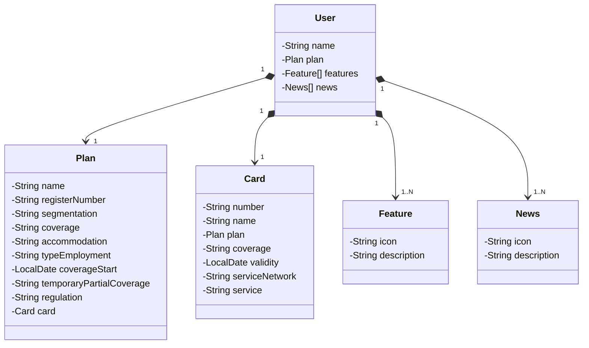

# Desafio proposto pela DIO no bootcamp de Desenvolvimento Java com IA
Java RESTful API criada para o desafio, inspirado no aplicativo da UNIMED.

## Diagrama de Classes

## Observações
O diagrama em questão é apenas para fins de estudo, considerando uma abstração simples. Podem existir planos de saúde que cubram mais de uma pessoa, ou um usuário pode ter mais de um plano. No entanto, esta modelagem considera uma relação 1 para 1.
